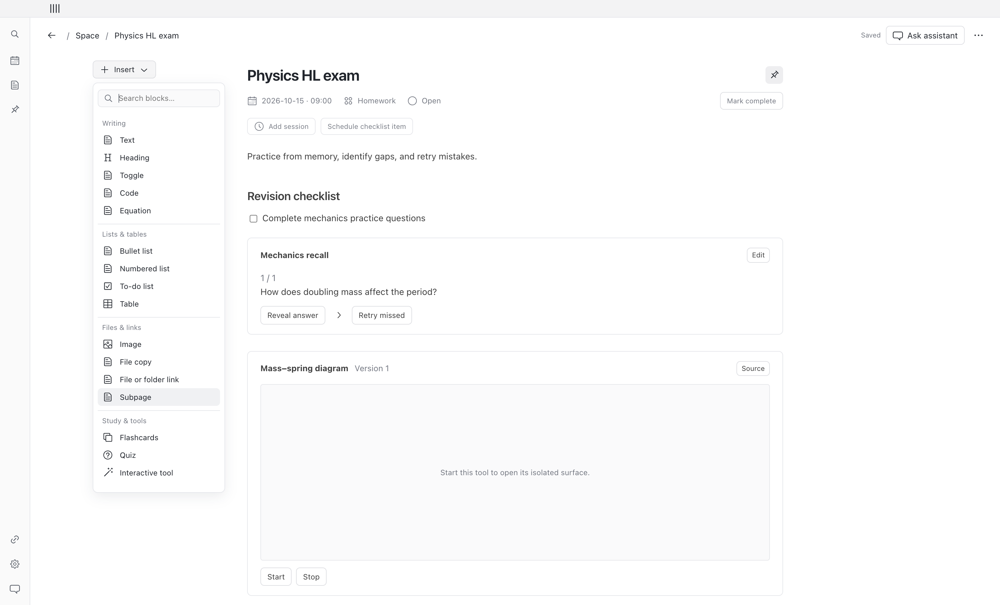

# Planner

A free, open-source Mac calendar with rich task pages. A deadline, a planned work session, and a fixed event remain separate. Calendar, Space, search, and the Codex companion refer to the same saved page.

The interface uses the Mac system font, a 48 px collapsed sidebar (176 px expanded), compact rows, and neutral surfaces. The first launch opens Calendar. Use **New** to start writing immediately, or load the optional example from Space.

## Run locally

Requires macOS and Node 24 or later for development. People using the packaged app do not need Node.

```sh
npm ci
npm run desktop
```

For the production renderer in a local Electron window:

```sh
npm start
```

For a browser-only design preview, use `npm run dev`. The preview stores its own local sample workspace; native files, encrypted storage, notifications, account connections, and the companion require the Mac app.

## Use the app

- **Calendar:** switch Month/Week, select a day to see its agenda, and open an entry's page. Schedule work separately from its deadline. A repeated work session has its own completion state.
- **Space:** Focus shows Needs attention, Pinned, Today, then Upcoming. All items includes undated ideas and label/status filters.
- **Pages:** write notes and use Insert, inline `+`, or `/` for blocks. Checklists, session completion, and parent completion are independent. Save a page as a reusable template.
- **Study:** practice flashcards and quizzes inside a page. The physics diagram runs in an isolated tool process and saves its own state.
- **Files:** Attach copies and encrypts a file; Link keeps a reference to a chosen original. A missing link can be located again.
- **Recovery:** Settings contains Trash and passphrase-protected backup/restore. Choose a backup folder to enable daily backups while Planner is running.
- **Reminders:** enable one on an entry you choose. Closing the window keeps Planner in the menu bar. Explicitly quitting stops reminders.

Writing autosaves. Navigation and quitting wait for pending edits. A conflicting revision leaves unsaved edits visible instead of overwriting newer content. See [support and recovery](docs/support.md).

## Preview and acceptance



The screenshots use a synthetic example workspace. [Acceptance evidence](docs/acceptance.md) records tested behavior and the remaining live checks. [Space screenshot](docs/screenshots/space.png), [visual QA](design-qa.md), and [provider setup packet](docs/provider-verification.md) provide more detail.

## Optional accounts

The local planner works without signing in. Sign in with ChatGPT is implemented using the supported local open-source route. Account model discovery and streamed inference require an eligible real account. This repository does not import ChatGPT conversation history.

Google and Microsoft connections use system-browser authorization and read-only scopes. Configure public application IDs using [.env.example](.env.example) in the development launch environment or packaging environment. Packaging embeds only those public IDs for normal Finder launches; credentials remain in encrypted storage. Provider test registrations and real user authorization are required. Email scans are manual; suggestions remain reviewable before they create or update a page.

Live account sign-in/inference, production provider approval, Apple signing/notarization, and notification delivery in a signed build are external acceptance gates. They are not established by fixture tests. See [release checklist](docs/release.md) and [privacy/data flows](docs/privacy.md).

## Codex companion

The app bundles a Node runtime and an MCP companion. Planner must be running. Add this repository's `.agents/plugins/marketplace.json` as a repository marketplace, then install **planner** in Codex. The plugin launches the runtime from `/Applications/Planner.app`; set `PLANNER_APP_PATH` if installed elsewhere. The companion connects through a private local socket and uses the same revision-checked commands as the interface.

No plugin is installed into your Codex settings automatically. Universal-directory distribution is a separate release gate.

## Verify and package

```sh
npm run typecheck
npm test
npm run build
npm run test:desktop
npm run make -- --arch=arm64
```

`test:desktop` uses a separate temporary profile and a test-only key. It does not read your real workspace. The normal app protects its encryption key through macOS Keychain.

Packaging writes to `out/`. Unsigned local builds are development candidates, not public release builds. See [release instructions](docs/release.md) for architecture, signing, and provider requirements.

## Structure and license

`src/core` owns validated commands and encrypted persistence; `src/electron` owns the single database process, selected-file access, native reminders, and tool isolation; `src/renderer` owns the compact interface; `src/integrations` contains account and provider adapters. [Interface contracts](docs/interfaces.md) describe the shared service.

Application code is MIT licensed. Dependencies retain their own licenses, including BlockNote core's MPL-2.0. See [dependency notices](docs/notices.md). No BlockNote XL modules are used.
