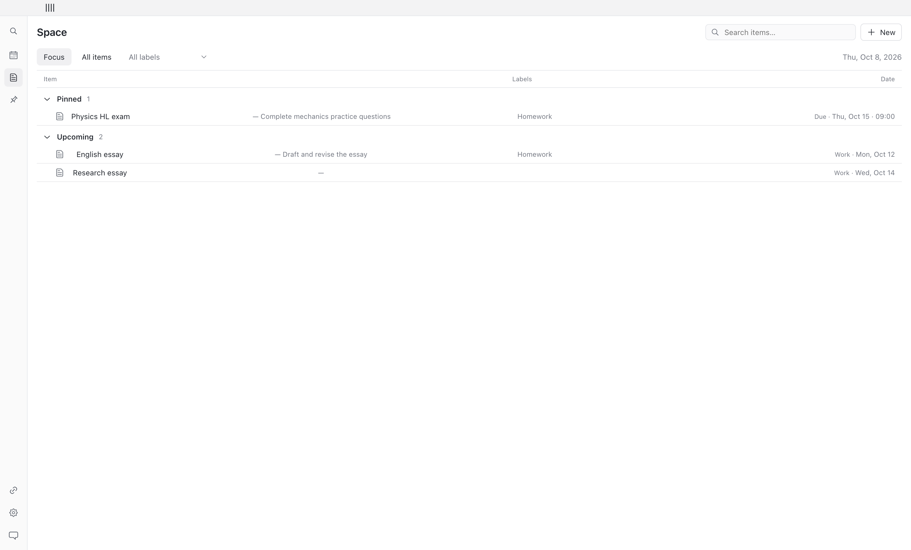
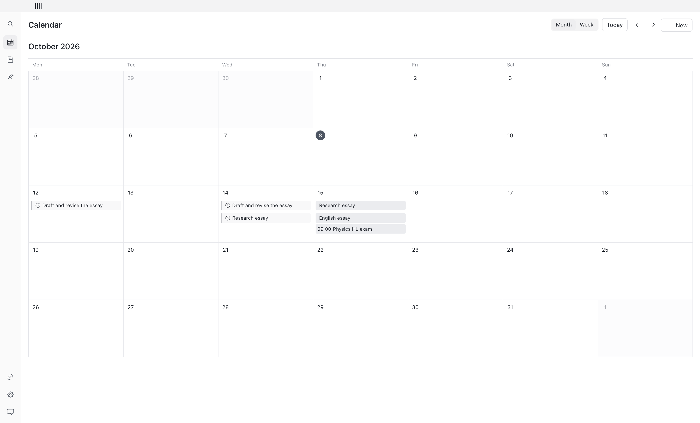
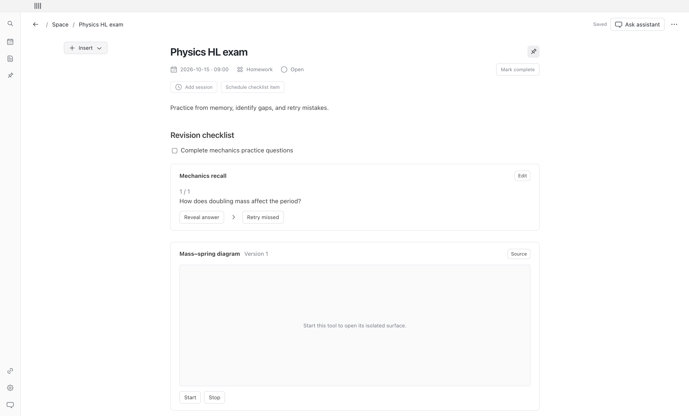
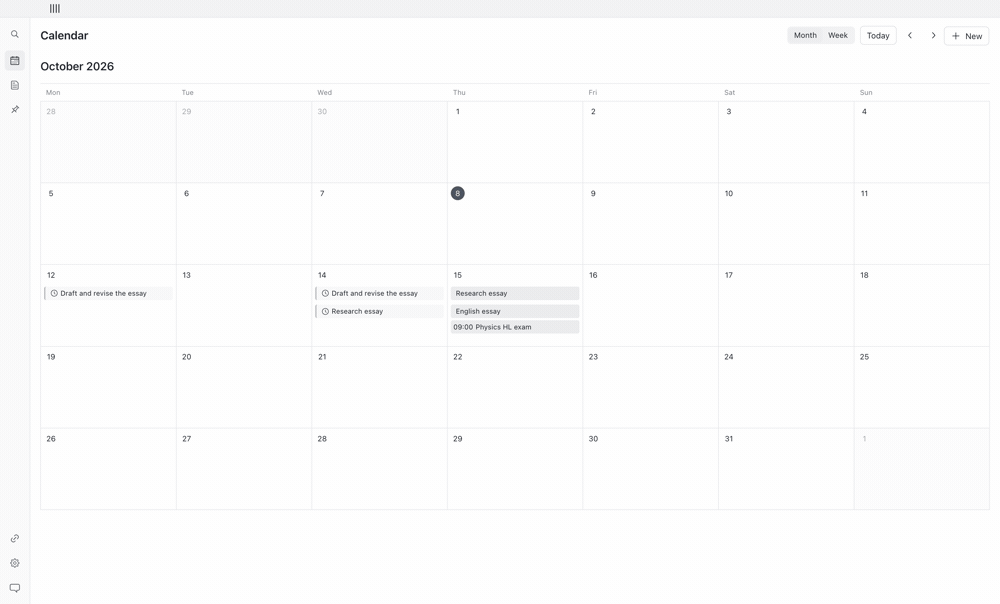

<div align="center">

# Planner

### A calendar with a workspace for every task.

A free, open-source Mac app for planning, writing, and studying.

[Get started](#get-started) · [Take a look](#inside-planner) · [What's new](#whats-new-in-v02) · [Mac checks](https://github.com/Cheezecats/mac-planner/actions/workflows/check-mac.yml)

</div>



An essay can be due on Thursday, have work planned for Monday and Wednesday, and keep its notes, checklist, and files in one page. Calendar, Space, search, and the optional Codex companion all open that same page.

## Inside Planner

| Plan the month | Open the work |
| --- | --- |
|  |  |
| See deadlines, work sessions, and fixed events together. Select a day to open its agenda. | Start writing with **New**, then insert the blocks you need. Return to the view you came from. |

<details>
<summary><strong>Watch a short screenshot tour</strong> — Calendar → Space → page → study tool</summary>



This tour cycles through screenshots of the synthetic example workspace. It is an overview of the interface, not a recording of live account integrations.

</details>

| Work in one place | Keep control of your data |
| --- | --- |
| Checklists, tables, code, equations, files, subpages, flashcards, quizzes, and saved interactive study tools. | Local encrypted storage, selected-file access, Trash, and passphrase-protected backups. The planner works without an account. |

The interface uses the Mac system font, neutral surfaces, and compact rows. The sidebar is 48 px when collapsed and 176 px when expanded. Text size and reduced motion are adjustable.

## What's new in v0.2

- **Keep your place:** opening a page retains your Calendar period/day or Space query, filters, expanded groups, and position.
- **Reopen safely:** keep later writing and schedule edits while restoring unchanged work and reminders disabled by completion. General Undo stays separate.
- **Find your work:** search titles, labels, and writing; choose results with arrows and Return; Escape returns focus.
- **Feel at home on Mac:** native New, Search, Settings, Today, Back/Forward, and Window menus, plus remembered window bounds.

v0.2 is a development candidate. The [Mac checks](https://github.com/Cheezecats/mac-planner/actions/workflows/check-mac.yml) and [acceptance record](docs/acceptance.md) track validation of both architectures and the remaining signing, account, and accessibility requirements. [Changelog](CHANGELOG.md) · [Release requirements](docs/release.md)

## Get started

Requires macOS and Node 24 or later for development. People using the packaged app do not need Node.

```sh
npm ci
npm run desktop
```

For the production renderer in a local Electron window:

```sh
npm start
```

For a browser-only design preview, use `npm run dev`. The preview stores its own local sample workspace; native files, encrypted storage, notifications, account connections, and the companion require the Mac app.

## Use the app

- **Calendar:** switch Month/Week, select a day to see its agenda, and open an entry's page. Back retains the period and day. Schedule work separately from its deadline. A repeated work session has its own completion state.
- **Space:** Focus shows active tasks in Needs attention, Pinned, Today, then Upcoming. All items includes undated ideas and label/status filters. Opening a page and returning preserves your list and position.
- **Pages:** write notes and use Insert, inline `+`, or `/` for blocks. Checklists, session completion, and parent completion are independent. Reopen preserves later edits and restores unchanged completion-disabled plans; Undo remains separate. Save a page as a reusable template.
- **Search and commands:** use `⌘K`, arrows, and Return to find and open a page; Escape returns focus. `⌘N` creates a page and `⌘,` opens Settings. Native menus also provide Today, Back, Forward, and window commands.
- **Study:** practice flashcards and quizzes inside a page. The physics diagram runs in an isolated tool process and saves its own state.
- **Files:** Attach copies and encrypts a file; Link keeps a reference to a chosen original. A missing link can be located again.
- **Recovery:** Settings contains Trash and passphrase-protected backup/restore. Choose a backup folder to enable daily backups while Planner is running.
- **Reminders:** enable one on an entry you choose. Closing the window keeps Planner in the menu bar. Explicitly quitting stops reminders.

Writing autosaves. Navigation and quitting wait for pending edits. A conflicting revision leaves unsaved edits visible instead of overwriting newer content. Window position is remembered across launches and adjusted for available displays. See [support and recovery](docs/support.md).

## Optional accounts

The local planner works without signing in. Sign in with ChatGPT is implemented using the supported local open-source route. Account model discovery and streamed inference require an eligible real account. This repository does not import ChatGPT conversation history.

Google and Microsoft connections use system-browser authorization and read-only scopes. Configure public application IDs using [.env.example](.env.example) in the development launch environment or packaging environment. Packaging embeds only those public IDs for normal Finder launches; credentials remain in encrypted storage. Provider test registrations and real user authorization are required. Email scans are manual; suggestions remain reviewable before they create or update a page.

Live account sign-in/inference, production provider approval, Apple signing/notarization, and notification delivery in a signed build are external acceptance gates. They are not established by fixture tests. See [release checklist](docs/release.md) and [privacy/data flows](docs/privacy.md).

## Codex companion

The app bundles a Node runtime and an MCP companion. Planner must be running. Add this repository's `.agents/plugins/marketplace.json` as a repository marketplace, then install **planner** in Codex. The plugin launches the runtime from `/Applications/Planner.app`; set `PLANNER_APP_PATH` if installed elsewhere. The companion connects through a private local socket and uses the same revision-checked commands as the interface.

No plugin is installed into your Codex settings automatically. Universal-directory distribution is a separate release gate.

## Where we're going

The next step is a dependable daily-use beta: validate both Mac architectures, actual Chinese input and VoiceOver, recovery on fresh installs/upgrades, and real account connections. Quick capture, an hourly Week view, and saved label/date views are follow-up directions. Sync and collaboration are separate future projects.

Ideas and reproducible problems are welcome in [GitHub Issues](https://github.com/Cheezecats/mac-planner/issues). [Support and recovery](docs/support.md) · [Privacy and data flows](docs/privacy.md)

## Verify and package

```sh
npm run typecheck
npm test
npm run build
npm run test:desktop
npm run make -- --arch=arm64
```

`test:desktop` uses a separate temporary profile and a test-only key. It does not read your real workspace. The normal app protects its encryption key through macOS Keychain.

Packaging writes to `out/`. Unsigned local builds are development candidates, not public release builds. See [release instructions](docs/release.md) for architecture, signing, and provider requirements.

## Structure and license

`src/core` owns validated commands and encrypted persistence; `src/electron` owns the single database process, selected-file access, native reminders, and tool isolation; `src/renderer` owns the compact interface; `src/integrations` contains account and provider adapters. [Interface contracts](docs/interfaces.md) describe the shared service.

Application code is MIT licensed. Dependencies retain their own licenses, including BlockNote core's MPL-2.0. See [dependency notices](docs/notices.md). No BlockNote XL modules are used.
